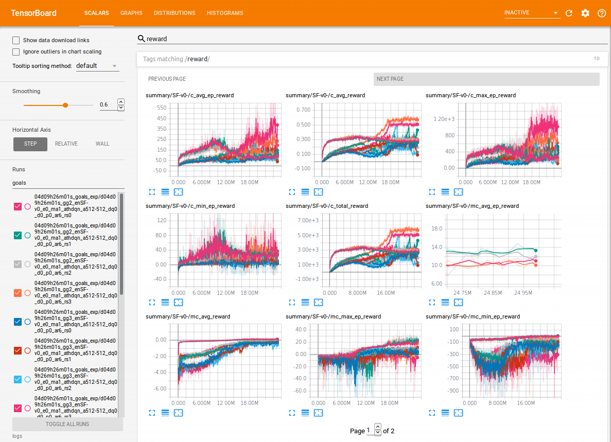
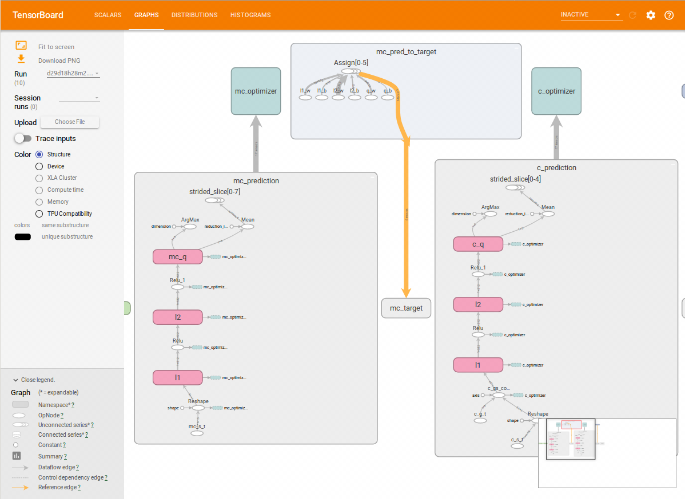

# h-DQN for Space Fortress
The purpose of this project is to use Hierarchical Deep Reinforcement Learning to solve the [Space Fortress](https://www.youtube.com/watch?v=tmRITTg70VE) Game implementing [hDQN](https://arxiv.org/abs/1604.06057) with Tensorflow.

The [DQN](https://www.nature.com/articles/nature14236) will be used as baseline with the extensions [Double Q learning](https://arxiv.org/abs/1509.06461), [Dueling architecture](https://arxiv.org/abs/1511.06581) and [Prioritized Experience Replay](https://arxiv.org/abs/1511.05952). This will be compared with another extension to handle options as actions via [**h-DQN**](https://arxiv.org/abs/1604.06057).

## Video of trained agents

- Experiment with dense rewards (easy): https://www.youtube.com/watch?v=OXT7jyvMJ2g
- Experiment with sparse rewards (hard): https://www.youtube.com/watch?v=ZJGslxgm2Uw&t=306s

## Code

I have mostyl coded all this project myself but I took some parts and also inspiration from these repositories:
 - https://github.com/devsisters/DQN-tensorflow
 - https://github.com/DerkBarten/SpaceFortress
 - https://github.com/cmusjtuliuyuan/RainBow
 
## Set up
Space Fortress libraries such as Cairo need to be installed as it is described in [this repo](https://github.com/DerkBarten/SpaceFortress).
Once the game has been compiled, the file(s) `sf_frame_lib_mines0.so` and `sf_frame_lib_mines1.so` should be located in [Environments/SpaceFortress/gym_space_fortress/envs/space_fortress/shared](Environments/SpaceFortress/gym_space_fortress/envs/space_fortress/shared)
This project is implemented in python 3.6 using tensorflow 1.8.

## Examples

Play as a human to see if the game is ready:

`python main.py --agent_type=human --env_name=SF-v0 --render_delay=42`

Train an DQN agent

`python main.py --agent_type=dqn --env_name=SF-v0 --scale=5000 --double_q=1 --dueling=1 --pmemory=1 --architecture=128-128-128`

When training a Hierarchical DQN agent we can set the desired DQN extensions separately for the meta-controller and controller using the prefixes 'mc' and 'c' respectively:

`python main.py --agent_type=hdqn --env_name=SF-v0 --scale=5000 --mc_double_q=1 --c_dueling=1 --c_pmemory=0 --goal_group=2`

The hyperparameters available from command line are listed in `main.py` and will overwrite the default values of all the available hyperparameters, which are listed in `configuration.py`.

The training will automatically generate the tensorboard logs and checkpoints of the network/s weights.

It will record videos of the last steps of the game. For each run, in the logs folder the files `watch0` and `record0` are created. These can be renamed back and forth to `watch1` (to visualize the training in a window) and `record1` (to generate videos) at any point during training.

### Goals
If using the hDQN version, one may want to define a new set of goals. Each set of goals is defined as a list of goal names (strings) in the `goal_groups` dict in `constants.py`. Sets of goals can be defined by 1) changing such dict and 2)  add the functionality to check if the goal is accomplished in the method `is_achieved` of the class `Goal`.

This projects makes an extensive use of tensorboard to visualize various learning metrics

One graph of the Hierarchical Reinforcement Learning agent:

